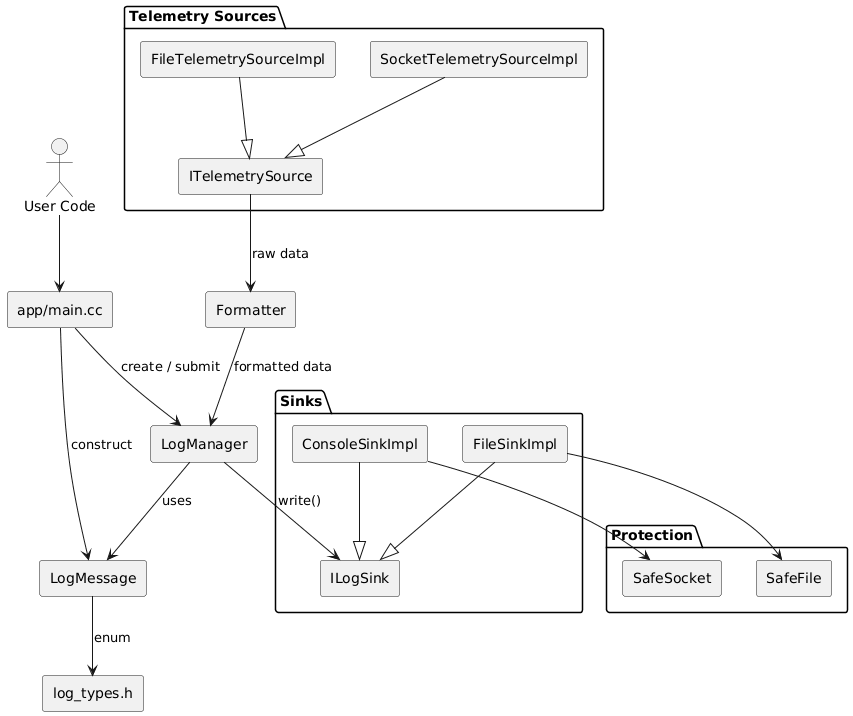

# LogDog
logging and telemetry app built as a project in the ITI

## Usage
To run this project, use the following command:
```
cmake -S . -B build
cmake --build build
./build/ldog
```
or using Bazel:

```
bazel build //:app
bazel run //:app
```

## System architecture

- a picture is worth a thousand words, right?